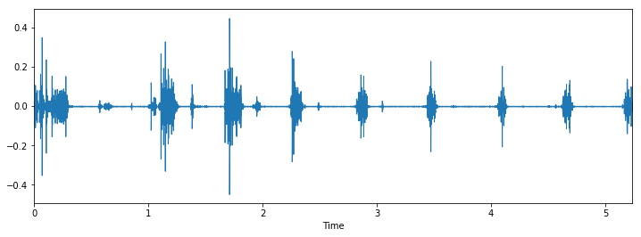
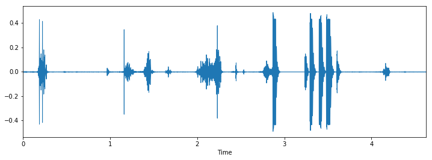
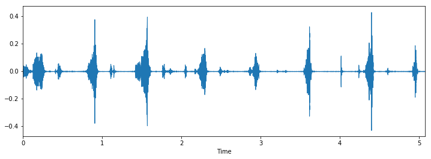
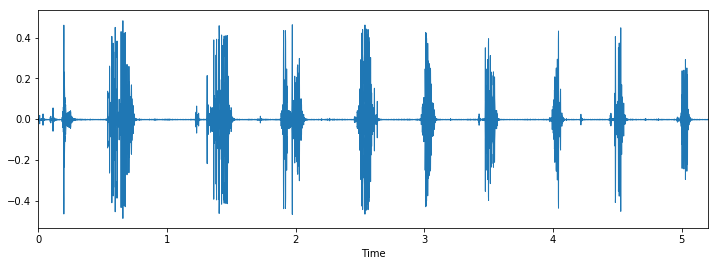
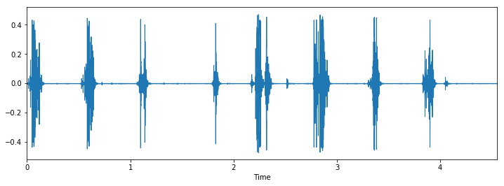
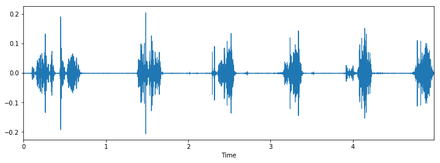
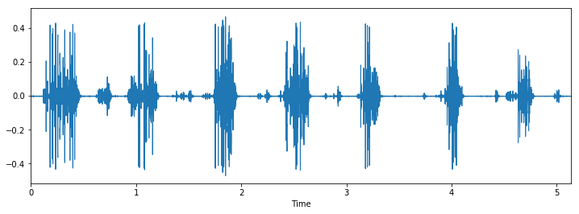
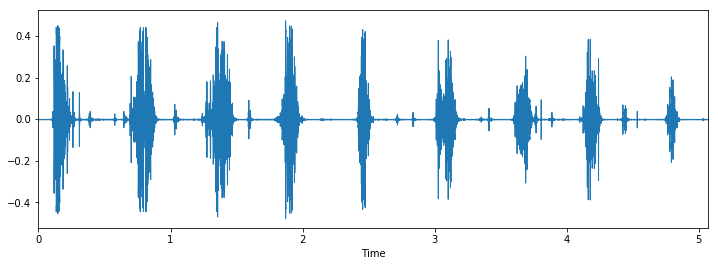
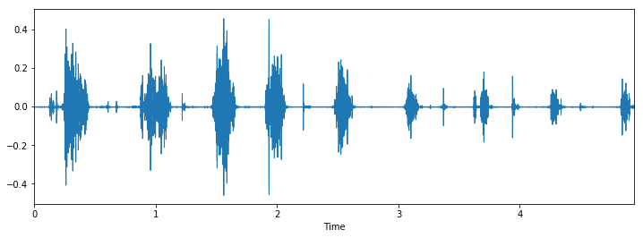
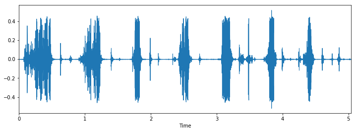

```python
%config IPCompleter.greedy=True
get_ipython().run_line_magic('config', 'IPCompleter.greedy=True')
import IPython.display as ipd
```


```python
#ipd.Audio(r'''C:\Users\dk\Desktop\samples\apple1.wav''')
```


```python
#ipd.Audio(r'''C:\Users\dk\Desktop\samples\carrot1.wav''')
```


```python
#ipd.Audio(r'''C:\Users\dk\Desktop\samples\pepper.wav''')
```


```python
#ipd.Audio(r'''C:\Users\dk\Desktop\samples\salad1.wav''')
```


```python
import librosa
data, sampling_rate = librosa.load(r'''C:\Users\dk\Desktop\samples\1.wav''')
data
```


    array([-0.00057799,  0.00344364, -0.00010096, ..., -0.00299958,
           -0.00150843, -0.00410081], dtype=float32)


```python
get_ipython().run_line_magic('pylab', 'inline')
import os
import pandas as pd
import librosa
import librosa.display
import glob 

plt.figure(figsize=(12, 4))
librosa.display.waveplot(data, sr=sampling_rate)
```

    Populating the interactive namespace from numpy and matplotlib
    


    <matplotlib.collections.PolyCollection at 0x182e6aee550>





```python
import time
train = pd.read_csv(r'''C:\Users\dk\Desktop\samples\train.csv''')
data_dir = r'''C:\Users\dk\Desktop\samples'''
def load_wave():
    i = random.choice(train.index)

    audio_name = train.ID[i]
    path = os.path.join(data_dir, str(audio_name) + '.wav')

    print('Class: ', train.Class[i])
    x, sr = librosa.load(path)

    plt.figure(figsize=(12, 4))
    librosa.display.waveplot(x, sr=sr)
    plt.show()

for i in range(10):
    load_wave()
```

    Class:  apple
    





    Class:  apple
    





    Class:  carrot
    





    Class:  apple
    





    Class:  pepper
    





    Class:  apple
    


    Class:  carrot
    





    Class:  chips
    





    Class:  chips
    


    Class:  chips
    





```python
i = random.choice(train.index)

audio_name = train.ID[i]
path = os.path.join(data_dir, str(audio_name) + '.wav')

print('Class: ', train.Class[i])
x, sr = librosa.load(r'''C:\Users\dk\Desktop\samples\\''' + str(train.ID[i]) + '.wav')

plt.figure(figsize=(12, 4))
librosa.display.waveplot(x, sr=sr)
```

    Class:  salad
    


    <matplotlib.collections.PolyCollection at 0x182e7d5efd0>





```python
train.Class.value_counts()
```


    apple     5
    pepper    4
    carrot    4
    chips     4
    salad     3
    oreo      1
    Name: Class, dtype: int64


```python
def parser(row):
   # function to load files and extract features
   file_name = os.path.join(os.path.abspath(data_dir), str(row.ID) + '.wav')

   # handle exception to check if there isn't a file which is corrupted
   try:
      # here kaiser_fast is a technique used for faster extraction
      X, sample_rate = librosa.load(file_name, res_type='kaiser_fast') 
      # we extract mfcc feature from data
      mfccs = np.mean(librosa.feature.mfcc(y=X, sr=sample_rate, n_mfcc=40).T,axis=0) 
   except Exception as e:
      print("Error encountered while parsing file: ", file)
      return None, None
 
   feature = mfccs
   label = row.Class
 
   return [feature, label]

temp = train.apply(parser, axis=1, result_type="expand")
temp.columns = ['feature', 'label']
temp.head(2)
```


<div>
<style scoped>
    .dataframe tbody tr th:only-of-type {
        vertical-align: middle;
    }

    .dataframe tbody tr th {
        vertical-align: top;
    }

    .dataframe thead th {
        text-align: right;
    }
</style>
<table border="1" class="dataframe">
  <thead>
    <tr style="text-align: right;">
      <th></th>
      <th>feature</th>
      <th>label</th>
    </tr>
  </thead>
  <tbody>
    <tr>
      <th>0</th>
      <td>[-437.38267777135934, 81.56379524289974, -1.38...</td>
      <td>salad</td>
    </tr>
    <tr>
      <th>1</th>
      <td>[-428.798613046622, 79.97818024286276, -9.3687...</td>
      <td>salad</td>
    </tr>
  </tbody>
</table>
</div>


```python
from sklearn.preprocessing import LabelEncoder
from keras.utils import np_utils

X = np.array(temp.feature.tolist())
y = np.array(temp.label.tolist())

lb = LabelEncoder()
print(lb.fit_transform(y)[:5])
y = np_utils.to_categorical(lb.fit_transform(y))
print(y.shape)
print(y[:10])
```

    [5 5 5 4 4]
    (21, 6)
    [[0. 0. 0. 0. 0. 1.]
     [0. 0. 0. 0. 0. 1.]
     [0. 0. 0. 0. 0. 1.]
     [0. 0. 0. 0. 1. 0.]
     [0. 0. 0. 0. 1. 0.]
     [0. 0. 0. 0. 1. 0.]
     [0. 0. 0. 0. 1. 0.]
     [0. 0. 0. 1. 0. 0.]
     [0. 0. 1. 0. 0. 0.]
     [0. 0. 1. 0. 0. 0.]]
    


```python
import numpy as np
from keras.models import Sequential
from keras.layers import Dense, Dropout, Activation, Flatten
from keras.layers import Convolution2D, MaxPooling2D
from keras.optimizers import Adam
from keras.utils import np_utils
from sklearn import metrics 

num_labels = y.shape[1]
filter_size = 2

# build model
model = Sequential()

model.add(Dense(256, input_shape=(40,)))
model.add(Activation('relu'))
model.add(Dropout(0.5))

model.add(Dense(256))
model.add(Activation('relu'))
model.add(Dropout(0.5))

model.add(Dense(num_labels))
model.add(Activation('softmax'))

model.compile(loss='categorical_crossentropy', metrics=['accuracy'], optimizer='adam')
```


```python
model.fit(X, y, batch_size=32, epochs=500, validation_split=0.1, shuffle=True)
```

    Train on 18 samples, validate on 3 samples
    Epoch 1/500
    18/18 [==============================] - 0s 612us/step - loss: 6.5144 - acc: 0.5000 - val_loss: 10.7613 - val_acc: 0.3333
    Epoch 2/500
    18/18 [==============================] - 0s 266us/step - loss: 6.0397 - acc: 0.5556 - val_loss: 10.7728 - val_acc: 0.3333
    Epoch 3/500
    18/18 [==============================] - 0s 504us/step - loss: 7.9709 - acc: 0.4444 - val_loss: 10.8619 - val_acc: 0.3333
    Epoch 4/500
    18/18 [==============================] - 0s 267us/step - loss: 6.2833 - acc: 0.6111 - val_loss: 11.1119 - val_acc: 0.0000e+00
    Epoch 5/500
    18/18 [==============================] - 0s 273us/step - loss: 6.5206 - acc: 0.5556 - val_loss: 11.5856 - val_acc: 0.0000e+00
    Epoch 6/500
    18/18 [==============================] - 0s 649us/step - loss: 5.5433 - acc: 0.5556 - val_loss: 11.4800 - val_acc: 0.0000e+00
    Epoch 7/500
    18/18 [==============================] - 0s 342us/step - loss: 5.3738 - acc: 0.6667 - val_loss: 11.3764 - val_acc: 0.0000e+00
    Epoch 8/500
    18/18 [==============================] - 0s 267us/step - loss: 5.1463 - acc: 0.5556 - val_loss: 11.0794 - val_acc: 0.0000e+00
    Epoch 9/500
    18/18 [==============================] - 0s 315us/step - loss: 5.3820 - acc: 0.6667 - val_loss: 10.8989 - val_acc: 0.3333
    Epoch 10/500
    18/18 [==============================] - 0s 276us/step - loss: 5.4318 - acc: 0.6111 - val_loss: 10.8111 - val_acc: 0.3333
    Epoch 11/500
    18/18 [==============================] - 0s 222us/step - loss: 6.2322 - acc: 0.4444 - val_loss: 10.7603 - val_acc: 0.3333
    Epoch 12/500
    18/18 [==============================] - 0s 445us/step - loss: 5.3747 - acc: 0.6667 - val_loss: 10.7491 - val_acc: 0.3333
    Epoch 13/500
    18/18 [==============================] - 0s 391us/step - loss: 7.2939 - acc: 0.4444 - val_loss: 10.7456 - val_acc: 0.3333
    Epoch 14/500
    18/18 [==============================] - 0s 431us/step - loss: 5.9083 - acc: 0.5556 - val_loss: 10.7454 - val_acc: 0.3333
    Epoch 15/500
    18/18 [==============================] - 0s 436us/step - loss: 6.1326 - acc: 0.5556 - val_loss: 10.7454 - val_acc: 0.3333
    Epoch 16/500
    18/18 [==============================] - 0s 488us/step - loss: 5.8186 - acc: 0.6111 - val_loss: 10.7454 - val_acc: 0.3333
    Epoch 17/500
    18/18 [==============================] - 0s 301us/step - loss: 5.3983 - acc: 0.6667 - val_loss: 10.7454 - val_acc: 0.3333
    Epoch 18/500
    18/18 [==============================] - 0s 685us/step - loss: 6.2216 - acc: 0.5556 - val_loss: 10.7454 - val_acc: 0.3333
    Epoch 19/500
    18/18 [==============================] - 0s 304us/step - loss: 6.0724 - acc: 0.5556 - val_loss: 10.7454 - val_acc: 0.3333
    Epoch 20/500
    18/18 [==============================] - 0s 314us/step - loss: 6.3137 - acc: 0.5556 - val_loss: 10.7454 - val_acc: 0.3333
    Epoch 21/500
    18/18 [==============================] - 0s 443us/step - loss: 6.5629 - acc: 0.5000 - val_loss: 10.7454 - val_acc: 0.3333
    Epoch 22/500
    18/18 [==============================] - 0s 611us/step - loss: 5.7558 - acc: 0.6111 - val_loss: 10.7454 - val_acc: 0.3333
    Epoch 23/500
    18/18 [==============================] - 0s 388us/step - loss: 5.8504 - acc: 0.6111 - val_loss: 10.7454 - val_acc: 0.3333
    Epoch 24/500
    18/18 [==============================] - 0s 761us/step - loss: 6.0976 - acc: 0.5556 - val_loss: 10.7454 - val_acc: 0.3333
    Epoch 25/500
    18/18 [==============================] - 0s 272us/step - loss: 7.5525 - acc: 0.5000 - val_loss: 10.7454 - val_acc: 0.3333
    Epoch 26/500
    18/18 [==============================] - 0s 396us/step - loss: 5.6125 - acc: 0.6111 - val_loss: 10.7454 - val_acc: 0.3333
    Epoch 27/500
    18/18 [==============================] - 0s 340us/step - loss: 5.6140 - acc: 0.6111 - val_loss: 10.7454 - val_acc: 0.3333
    Epoch 28/500
    18/18 [==============================] - 0s 298us/step - loss: 5.5338 - acc: 0.6111 - val_loss: 10.7454 - val_acc: 0.3333
    Epoch 29/500
    18/18 [==============================] - 0s 259us/step - loss: 4.5166 - acc: 0.6667 - val_loss: 10.7454 - val_acc: 0.3333
    Epoch 30/500
    18/18 [==============================] - 0s 432us/step - loss: 6.8457 - acc: 0.4444 - val_loss: 10.7454 - val_acc: 0.3333
    Epoch 31/500
    18/18 [==============================] - 0s 405us/step - loss: 7.5752 - acc: 0.4444 - val_loss: 10.7461 - val_acc: 0.3333
    Epoch 32/500
    18/18 [==============================] - 0s 390us/step - loss: 5.7987 - acc: 0.5000 - val_loss: 10.7507 - val_acc: 0.3333
    Epoch 33/500
    18/18 [==============================] - 0s 295us/step - loss: 5.3761 - acc: 0.6667 - val_loss: 10.7748 - val_acc: 0.3333
    Epoch 34/500
    18/18 [==============================] - 0s 292us/step - loss: 5.3780 - acc: 0.6667 - val_loss: 10.8646 - val_acc: 0.3333
    Epoch 35/500
    18/18 [==============================] - 0s 414us/step - loss: 5.3731 - acc: 0.6667 - val_loss: 11.0844 - val_acc: 0.0000e+00
    Epoch 36/500
    18/18 [==============================] - 0s 318us/step - loss: 6.5940 - acc: 0.5000 - val_loss: 11.2455 - val_acc: 0.0000e+00
    Epoch 37/500
    18/18 [==============================] - 0s 279us/step - loss: 5.3737 - acc: 0.6667 - val_loss: 11.4193 - val_acc: 0.0000e+00
    Epoch 38/500
    18/18 [==============================] - 0s 332us/step - loss: 5.3980 - acc: 0.6667 - val_loss: 11.5251 - val_acc: 0.0000e+00
    Epoch 39/500
    18/18 [==============================] - 0s 283us/step - loss: 5.4198 - acc: 0.6111 - val_loss: 11.5823 - val_acc: 0.0000e+00
    Epoch 40/500
    18/18 [==============================] - 0s 319us/step - loss: 5.4863 - acc: 0.6111 - val_loss: 11.7733 - val_acc: 0.0000e+00
    Epoch 41/500
    18/18 [==============================] - 0s 356us/step - loss: 6.3508 - acc: 0.5000 - val_loss: 11.7689 - val_acc: 0.0000e+00
    Epoch 42/500
    18/18 [==============================] - 0s 510us/step - loss: 5.3750 - acc: 0.6667 - val_loss: 11.7580 - val_acc: 0.0000e+00
    Epoch 43/500
    18/18 [==============================] - 0s 415us/step - loss: 4.9055 - acc: 0.6111 - val_loss: 11.3261 - val_acc: 0.0000e+00
    Epoch 44/500
    18/18 [==============================] - 0s 419us/step - loss: 6.8016 - acc: 0.5556 - val_loss: 10.8717 - val_acc: 0.3333
    Epoch 45/500
    18/18 [==============================] - 0s 380us/step - loss: 5.0905 - acc: 0.6667 - val_loss: 10.7596 - val_acc: 0.3333
    Epoch 46/500
    18/18 [==============================] - 0s 446us/step - loss: 5.8180 - acc: 0.6111 - val_loss: 10.7469 - val_acc: 0.3333
    Epoch 47/500
    18/18 [==============================] - 0s 322us/step - loss: 5.9680 - acc: 0.6111 - val_loss: 10.7458 - val_acc: 0.3333
    Epoch 48/500
    18/18 [==============================] - 0s 240us/step - loss: 5.3910 - acc: 0.6667 - val_loss: 10.7455 - val_acc: 0.3333
    Epoch 49/500
    18/18 [==============================] - 0s 256us/step - loss: 5.5957 - acc: 0.5000 - val_loss: 10.7455 - val_acc: 0.3333
    Epoch 50/500
    18/18 [==============================] - 0s 213us/step - loss: 6.1259 - acc: 0.5556 - val_loss: 10.7456 - val_acc: 0.3333
    Epoch 51/500
    18/18 [==============================] - 0s 447us/step - loss: 5.5976 - acc: 0.5556 - val_loss: 10.7458 - val_acc: 0.3333
    Epoch 52/500
    18/18 [==============================] - 0s 279us/step - loss: 5.3758 - acc: 0.6667 - val_loss: 10.7462 - val_acc: 0.3333
    Epoch 53/500
    18/18 [==============================] - 0s 296us/step - loss: 6.2814 - acc: 0.6111 - val_loss: 10.7467 - val_acc: 0.3333
    Epoch 54/500
    18/18 [==============================] - 0s 253us/step - loss: 5.9186 - acc: 0.5556 - val_loss: 10.7468 - val_acc: 0.3333
    Epoch 55/500
    18/18 [==============================] - 0s 247us/step - loss: 5.5743 - acc: 0.6111 - val_loss: 10.7483 - val_acc: 0.3333
    Epoch 56/500
    18/18 [==============================] - 0s 323us/step - loss: 5.3809 - acc: 0.6667 - val_loss: 10.7507 - val_acc: 0.3333
    Epoch 57/500
    18/18 [==============================] - 0s 361us/step - loss: 5.5223 - acc: 0.6111 - val_loss: 10.7542 - val_acc: 0.3333
    Epoch 58/500
    18/18 [==============================] - 0s 311us/step - loss: 5.2600 - acc: 0.6111 - val_loss: 10.7527 - val_acc: 0.3333
    Epoch 59/500
    18/18 [==============================] - 0s 393us/step - loss: 5.1217 - acc: 0.5000 - val_loss: 10.7525 - val_acc: 0.3333
    Epoch 60/500
    18/18 [==============================] - 0s 252us/step - loss: 4.7586 - acc: 0.6667 - val_loss: 10.7514 - val_acc: 0.3333
    Epoch 61/500
    18/18 [==============================] - 0s 345us/step - loss: 4.9653 - acc: 0.6667 - val_loss: 10.7492 - val_acc: 0.3333
    Epoch 62/500
    18/18 [==============================] - 0s 404us/step - loss: 6.0035 - acc: 0.4444 - val_loss: 10.7470 - val_acc: 0.3333
    Epoch 63/500
    18/18 [==============================] - 0s 275us/step - loss: 5.3930 - acc: 0.6111 - val_loss: 10.7459 - val_acc: 0.3333
    Epoch 64/500
    18/18 [==============================] - 0s 400us/step - loss: 4.8856 - acc: 0.6111 - val_loss: 10.7455 - val_acc: 0.3333
    Epoch 65/500
    18/18 [==============================] - 0s 247us/step - loss: 5.2092 - acc: 0.5556 - val_loss: 10.4361 - val_acc: 0.3333
    Epoch 66/500
    18/18 [==============================] - 0s 266us/step - loss: 4.6693 - acc: 0.6667 - val_loss: 10.1063 - val_acc: 0.3333
    Epoch 67/500
    18/18 [==============================] - 0s 281us/step - loss: 3.3989 - acc: 0.7222 - val_loss: 9.8527 - val_acc: 0.3333
    Epoch 68/500
    18/18 [==============================] - 0s 451us/step - loss: 4.6330 - acc: 0.6111 - val_loss: 9.5190 - val_acc: 0.3333
    Epoch 69/500
    18/18 [==============================] - 0s 410us/step - loss: 4.4761 - acc: 0.5556 - val_loss: 9.0138 - val_acc: 0.3333
    Epoch 70/500
    18/18 [==============================] - 0s 235us/step - loss: 4.7189 - acc: 0.6111 - val_loss: 8.5437 - val_acc: 0.3333
    Epoch 71/500
    18/18 [==============================] - 0s 252us/step - loss: 4.5441 - acc: 0.6111 - val_loss: 8.0576 - val_acc: 0.3333
    Epoch 72/500
    18/18 [==============================] - 0s 449us/step - loss: 4.0198 - acc: 0.5556 - val_loss: 7.9362 - val_acc: 0.3333
    Epoch 73/500
    18/18 [==============================] - 0s 254us/step - loss: 4.3909 - acc: 0.5000 - val_loss: 7.9876 - val_acc: 0.3333
    Epoch 74/500
    18/18 [==============================] - 0s 434us/step - loss: 4.0539 - acc: 0.5556 - val_loss: 8.2843 - val_acc: 0.3333
    Epoch 75/500
    18/18 [==============================] - 0s 339us/step - loss: 2.0125 - acc: 0.7222 - val_loss: 8.4937 - val_acc: 0.3333
    Epoch 76/500
    18/18 [==============================] - 0s 475us/step - loss: 4.2543 - acc: 0.6111 - val_loss: 8.7020 - val_acc: 0.3333
    Epoch 77/500
    18/18 [==============================] - 0s 333us/step - loss: 3.4586 - acc: 0.5556 - val_loss: 8.8954 - val_acc: 0.3333
    Epoch 78/500
    18/18 [==============================] - 0s 479us/step - loss: 4.2322 - acc: 0.5000 - val_loss: 9.1231 - val_acc: 0.3333
    Epoch 79/500
    18/18 [==============================] - 0s 282us/step - loss: 3.4494 - acc: 0.7222 - val_loss: 9.2259 - val_acc: 0.3333
    Epoch 80/500
    18/18 [==============================] - 0s 290us/step - loss: 5.0062 - acc: 0.3889 - val_loss: 9.4694 - val_acc: 0.3333
    Epoch 81/500
    18/18 [==============================] - 0s 345us/step - loss: 3.0979 - acc: 0.5556 - val_loss: 9.7397 - val_acc: 0.3333
    Epoch 82/500
    18/18 [==============================] - 0s 222us/step - loss: 3.6475 - acc: 0.5000 - val_loss: 9.8610 - val_acc: 0.3333
    Epoch 83/500
    18/18 [==============================] - 0s 335us/step - loss: 2.8768 - acc: 0.5556 - val_loss: 9.8041 - val_acc: 0.3333
    Epoch 84/500
    18/18 [==============================] - 0s 271us/step - loss: 2.8696 - acc: 0.6667 - val_loss: 9.7119 - val_acc: 0.3333
    Epoch 85/500
    18/18 [==============================] - 0s 380us/step - loss: 2.1987 - acc: 0.5556 - val_loss: 9.6478 - val_acc: 0.3333
    Epoch 86/500
    18/18 [==============================] - 0s 284us/step - loss: 3.6592 - acc: 0.5556 - val_loss: 9.2930 - val_acc: 0.3333
    Epoch 87/500
    18/18 [==============================] - 0s 269us/step - loss: 2.6723 - acc: 0.6111 - val_loss: 9.0014 - val_acc: 0.3333
    Epoch 88/500
    18/18 [==============================] - 0s 454us/step - loss: 2.1881 - acc: 0.6667 - val_loss: 8.7091 - val_acc: 0.3333
    Epoch 89/500
    18/18 [==============================] - 0s 296us/step - loss: 2.8648 - acc: 0.5000 - val_loss: 8.5263 - val_acc: 0.3333
    Epoch 90/500
    18/18 [==============================] - 0s 396us/step - loss: 2.7667 - acc: 0.6111 - val_loss: 8.1892 - val_acc: 0.3333
    Epoch 91/500
    18/18 [==============================] - 0s 347us/step - loss: 3.4034 - acc: 0.5556 - val_loss: 7.8576 - val_acc: 0.3333
    Epoch 92/500
    18/18 [==============================] - 0s 365us/step - loss: 2.8643 - acc: 0.5000 - val_loss: 7.3192 - val_acc: 0.3333
    Epoch 93/500
    18/18 [==============================] - 0s 265us/step - loss: 2.0609 - acc: 0.6111 - val_loss: 6.7552 - val_acc: 0.3333
    Epoch 94/500
    18/18 [==============================] - 0s 262us/step - loss: 1.8602 - acc: 0.5000 - val_loss: 6.2814 - val_acc: 0.3333
    Epoch 95/500
    18/18 [==============================] - 0s 254us/step - loss: 2.0540 - acc: 0.7222 - val_loss: 5.9390 - val_acc: 0.3333
    Epoch 96/500
    18/18 [==============================] - 0s 334us/step - loss: 2.0123 - acc: 0.5556 - val_loss: 5.6051 - val_acc: 0.3333
    Epoch 97/500
    18/18 [==============================] - 0s 404us/step - loss: 1.7437 - acc: 0.7222 - val_loss: 5.3292 - val_acc: 0.3333
    Epoch 98/500
    18/18 [==============================] - 0s 455us/step - loss: 1.9318 - acc: 0.6111 - val_loss: 5.1738 - val_acc: 0.3333
    Epoch 99/500
    18/18 [==============================] - 0s 284us/step - loss: 1.4685 - acc: 0.6667 - val_loss: 5.0250 - val_acc: 0.3333
    Epoch 100/500
    18/18 [==============================] - 0s 280us/step - loss: 2.3774 - acc: 0.5000 - val_loss: 5.0297 - val_acc: 0.3333
    Epoch 101/500
    18/18 [==============================] - 0s 309us/step - loss: 1.5483 - acc: 0.6667 - val_loss: 5.0251 - val_acc: 0.3333
    Epoch 102/500
    18/18 [==============================] - 0s 274us/step - loss: 1.4842 - acc: 0.6667 - val_loss: 5.0267 - val_acc: 0.3333
    Epoch 103/500
    18/18 [==============================] - 0s 319us/step - loss: 1.3069 - acc: 0.8333 - val_loss: 5.0782 - val_acc: 0.3333
    Epoch 104/500
    18/18 [==============================] - 0s 275us/step - loss: 1.3248 - acc: 0.7222 - val_loss: 5.1141 - val_acc: 0.3333
    Epoch 105/500
    18/18 [==============================] - 0s 268us/step - loss: 1.1614 - acc: 0.7778 - val_loss: 5.1692 - val_acc: 0.3333
    Epoch 106/500
    18/18 [==============================] - 0s 277us/step - loss: 1.3357 - acc: 0.7222 - val_loss: 5.2230 - val_acc: 0.3333
    Epoch 107/500
    18/18 [==============================] - 0s 223us/step - loss: 1.4986 - acc: 0.7222 - val_loss: 5.3245 - val_acc: 0.3333
    Epoch 108/500
    18/18 [==============================] - 0s 345us/step - loss: 1.6390 - acc: 0.8333 - val_loss: 5.3592 - val_acc: 0.3333
    Epoch 109/500
    18/18 [==============================] - 0s 243us/step - loss: 1.4428 - acc: 0.6667 - val_loss: 5.4323 - val_acc: 0.3333
    Epoch 110/500
    18/18 [==============================] - 0s 269us/step - loss: 1.3344 - acc: 0.7778 - val_loss: 5.4722 - val_acc: 0.3333
    Epoch 111/500
    18/18 [==============================] - 0s 432us/step - loss: 1.6427 - acc: 0.6667 - val_loss: 5.5057 - val_acc: 0.3333
    Epoch 112/500
    18/18 [==============================] - 0s 368us/step - loss: 1.1918 - acc: 0.8333 - val_loss: 5.4946 - val_acc: 0.3333
    Epoch 113/500
    18/18 [==============================] - 0s 367us/step - loss: 1.3657 - acc: 0.8333 - val_loss: 5.4612 - val_acc: 0.3333
    Epoch 114/500
    18/18 [==============================] - 0s 363us/step - loss: 1.0918 - acc: 0.8889 - val_loss: 5.4007 - val_acc: 0.3333
    Epoch 115/500
    18/18 [==============================] - 0s 429us/step - loss: 1.8976 - acc: 0.7222 - val_loss: 5.3230 - val_acc: 0.3333
    Epoch 116/500
    18/18 [==============================] - 0s 271us/step - loss: 1.5024 - acc: 0.5556 - val_loss: 5.2245 - val_acc: 0.3333
    Epoch 117/500
    18/18 [==============================] - 0s 424us/step - loss: 1.4941 - acc: 0.7778 - val_loss: 5.1265 - val_acc: 0.3333
    Epoch 118/500
    18/18 [==============================] - 0s 273us/step - loss: 1.2547 - acc: 0.8333 - val_loss: 5.0545 - val_acc: 0.3333
    Epoch 119/500
    18/18 [==============================] - 0s 246us/step - loss: 1.1026 - acc: 0.8889 - val_loss: 4.9771 - val_acc: 0.3333
    Epoch 120/500
    18/18 [==============================] - 0s 315us/step - loss: 1.2152 - acc: 0.8333 - val_loss: 4.8887 - val_acc: 0.3333
    Epoch 121/500
    18/18 [==============================] - 0s 266us/step - loss: 1.2536 - acc: 0.7778 - val_loss: 4.8222 - val_acc: 0.3333
    Epoch 122/500
    18/18 [==============================] - 0s 396us/step - loss: 1.3227 - acc: 0.7778 - val_loss: 4.7663 - val_acc: 0.3333
    Epoch 123/500
    18/18 [==============================] - 0s 316us/step - loss: 1.2862 - acc: 0.7778 - val_loss: 4.7587 - val_acc: 0.3333
    Epoch 124/500
    18/18 [==============================] - 0s 376us/step - loss: 1.1930 - acc: 0.8333 - val_loss: 4.7534 - val_acc: 0.3333
    Epoch 125/500
    18/18 [==============================] - 0s 325us/step - loss: 1.4099 - acc: 0.8333 - val_loss: 4.6759 - val_acc: 0.3333
    Epoch 126/500
    18/18 [==============================] - 0s 352us/step - loss: 1.2168 - acc: 0.7778 - val_loss: 4.6125 - val_acc: 0.3333
    Epoch 127/500
    18/18 [==============================] - 0s 336us/step - loss: 1.3222 - acc: 0.7778 - val_loss: 4.6165 - val_acc: 0.3333
    Epoch 128/500
    18/18 [==============================] - 0s 491us/step - loss: 1.1053 - acc: 0.8889 - val_loss: 4.6373 - val_acc: 0.3333
    Epoch 129/500
    18/18 [==============================] - 0s 341us/step - loss: 1.1518 - acc: 0.8889 - val_loss: 4.6833 - val_acc: 0.3333
    Epoch 130/500
    18/18 [==============================] - 0s 393us/step - loss: 1.4653 - acc: 0.7222 - val_loss: 4.7719 - val_acc: 0.3333
    Epoch 131/500
    18/18 [==============================] - 0s 443us/step - loss: 1.2356 - acc: 0.8889 - val_loss: 4.8311 - val_acc: 0.3333
    Epoch 132/500
    18/18 [==============================] - 0s 323us/step - loss: 1.3589 - acc: 0.7778 - val_loss: 4.8643 - val_acc: 0.3333
    Epoch 133/500
    18/18 [==============================] - 0s 352us/step - loss: 1.3323 - acc: 0.7222 - val_loss: 4.8359 - val_acc: 0.3333
    Epoch 134/500
    18/18 [==============================] - 0s 363us/step - loss: 1.2386 - acc: 0.7778 - val_loss: 4.7935 - val_acc: 0.3333
    Epoch 135/500
    18/18 [==============================] - 0s 299us/step - loss: 1.3761 - acc: 0.7222 - val_loss: 4.7458 - val_acc: 0.3333
    Epoch 136/500
    18/18 [==============================] - 0s 276us/step - loss: 1.2727 - acc: 0.7778 - val_loss: 4.6728 - val_acc: 0.3333
    Epoch 137/500
    18/18 [==============================] - 0s 355us/step - loss: 1.0879 - acc: 0.8889 - val_loss: 4.5972 - val_acc: 0.3333
    Epoch 138/500
    18/18 [==============================] - 0s 299us/step - loss: 1.1567 - acc: 0.8333 - val_loss: 4.5488 - val_acc: 0.3333
    Epoch 139/500
    18/18 [==============================] - 0s 295us/step - loss: 1.4922 - acc: 0.7222 - val_loss: 4.6358 - val_acc: 0.3333
    Epoch 140/500
    18/18 [==============================] - 0s 587us/step - loss: 0.9941 - acc: 0.8889 - val_loss: 4.7273 - val_acc: 0.3333
    Epoch 141/500
    18/18 [==============================] - 0s 360us/step - loss: 1.2797 - acc: 0.6667 - val_loss: 4.7867 - val_acc: 0.3333
    Epoch 142/500
    18/18 [==============================] - 0s 280us/step - loss: 1.4253 - acc: 0.7222 - val_loss: 4.8485 - val_acc: 0.3333
    Epoch 143/500
    18/18 [==============================] - 0s 278us/step - loss: 1.4344 - acc: 0.7222 - val_loss: 4.9487 - val_acc: 0.3333
    Epoch 144/500
    18/18 [==============================] - 0s 391us/step - loss: 1.1943 - acc: 0.8333 - val_loss: 4.9886 - val_acc: 0.3333
    Epoch 145/500
    18/18 [==============================] - 0s 292us/step - loss: 1.1473 - acc: 0.8889 - val_loss: 5.1614 - val_acc: 0.3333
    Epoch 146/500
    18/18 [==============================] - 0s 342us/step - loss: 1.0888 - acc: 0.8333 - val_loss: 5.3259 - val_acc: 0.3333
    Epoch 147/500
    18/18 [==============================] - 0s 355us/step - loss: 1.1968 - acc: 0.8333 - val_loss: 5.5580 - val_acc: 0.3333
    Epoch 148/500
    18/18 [==============================] - 0s 383us/step - loss: 1.4401 - acc: 0.7222 - val_loss: 5.7133 - val_acc: 0.3333
    Epoch 149/500
    18/18 [==============================] - 0s 375us/step - loss: 1.1762 - acc: 0.8889 - val_loss: 5.8295 - val_acc: 0.3333
    Epoch 150/500
    18/18 [==============================] - 0s 414us/step - loss: 1.1033 - acc: 0.8333 - val_loss: 5.9166 - val_acc: 0.3333
    Epoch 151/500
    18/18 [==============================] - 0s 324us/step - loss: 1.3751 - acc: 0.7778 - val_loss: 5.9414 - val_acc: 0.3333
    Epoch 152/500
    18/18 [==============================] - 0s 300us/step - loss: 1.1532 - acc: 0.8889 - val_loss: 5.9653 - val_acc: 0.3333
    Epoch 153/500
    18/18 [==============================] - 0s 287us/step - loss: 1.3690 - acc: 0.8333 - val_loss: 5.9874 - val_acc: 0.3333
    Epoch 154/500
    18/18 [==============================] - 0s 246us/step - loss: 1.0163 - acc: 0.8889 - val_loss: 6.0215 - val_acc: 0.3333
    Epoch 155/500
    18/18 [==============================] - 0s 411us/step - loss: 1.0887 - acc: 0.8889 - val_loss: 6.0672 - val_acc: 0.3333
    Epoch 156/500
    18/18 [==============================] - 0s 333us/step - loss: 0.9667 - acc: 0.8889 - val_loss: 6.1332 - val_acc: 0.3333
    Epoch 157/500
    18/18 [==============================] - 0s 278us/step - loss: 1.3379 - acc: 0.7778 - val_loss: 6.1497 - val_acc: 0.3333
    Epoch 158/500
    18/18 [==============================] - 0s 282us/step - loss: 1.0751 - acc: 0.8889 - val_loss: 6.1633 - val_acc: 0.3333
    Epoch 159/500
    18/18 [==============================] - 0s 305us/step - loss: 1.4026 - acc: 0.7222 - val_loss: 6.0960 - val_acc: 0.3333
    Epoch 160/500
    18/18 [==============================] - 0s 293us/step - loss: 1.1352 - acc: 0.8333 - val_loss: 5.9925 - val_acc: 0.3333
    Epoch 161/500
    18/18 [==============================] - 0s 266us/step - loss: 1.1484 - acc: 0.8333 - val_loss: 5.8656 - val_acc: 0.3333
    Epoch 162/500
    18/18 [==============================] - 0s 308us/step - loss: 1.0733 - acc: 0.8889 - val_loss: 5.7728 - val_acc: 0.3333
    Epoch 163/500
    18/18 [==============================] - 0s 311us/step - loss: 1.2680 - acc: 0.7222 - val_loss: 5.6567 - val_acc: 0.3333
    Epoch 164/500
    18/18 [==============================] - 0s 299us/step - loss: 1.0771 - acc: 0.8333 - val_loss: 5.5848 - val_acc: 0.3333
    Epoch 165/500
    18/18 [==============================] - 0s 382us/step - loss: 1.3863 - acc: 0.6667 - val_loss: 5.5016 - val_acc: 0.3333
    Epoch 166/500
    18/18 [==============================] - 0s 349us/step - loss: 1.1130 - acc: 0.8889 - val_loss: 5.3992 - val_acc: 0.3333
    Epoch 167/500
    18/18 [==============================] - 0s 422us/step - loss: 1.1851 - acc: 0.8333 - val_loss: 5.2872 - val_acc: 0.3333
    Epoch 168/500
    18/18 [==============================] - 0s 336us/step - loss: 1.8708 - acc: 0.6667 - val_loss: 5.2182 - val_acc: 0.3333
    Epoch 169/500
    18/18 [==============================] - 0s 277us/step - loss: 1.1324 - acc: 0.8889 - val_loss: 5.2110 - val_acc: 0.3333
    Epoch 170/500
    18/18 [==============================] - 0s 237us/step - loss: 1.0997 - acc: 0.8889 - val_loss: 5.1819 - val_acc: 0.3333
    Epoch 171/500
    18/18 [==============================] - 0s 340us/step - loss: 1.2427 - acc: 0.7778 - val_loss: 5.1462 - val_acc: 0.3333
    Epoch 172/500
    18/18 [==============================] - 0s 411us/step - loss: 1.1248 - acc: 0.8333 - val_loss: 5.1432 - val_acc: 0.3333
    Epoch 173/500
    18/18 [==============================] - 0s 352us/step - loss: 1.2741 - acc: 0.8333 - val_loss: 5.1543 - val_acc: 0.3333
    Epoch 174/500
    18/18 [==============================] - 0s 348us/step - loss: 1.2534 - acc: 0.7778 - val_loss: 5.1763 - val_acc: 0.3333
    Epoch 175/500
    18/18 [==============================] - 0s 242us/step - loss: 1.1734 - acc: 0.8333 - val_loss: 5.1830 - val_acc: 0.3333
    Epoch 176/500
    18/18 [==============================] - 0s 267us/step - loss: 1.4348 - acc: 0.8333 - val_loss: 5.1441 - val_acc: 0.3333
    Epoch 177/500
    18/18 [==============================] - 0s 285us/step - loss: 1.0793 - acc: 0.8333 - val_loss: 5.1063 - val_acc: 0.3333
    Epoch 178/500
    18/18 [==============================] - 0s 427us/step - loss: 1.1800 - acc: 0.7778 - val_loss: 5.0538 - val_acc: 0.3333
    Epoch 179/500
    18/18 [==============================] - 0s 410us/step - loss: 1.0241 - acc: 0.8889 - val_loss: 5.0080 - val_acc: 0.3333
    Epoch 180/500
    18/18 [==============================] - 0s 221us/step - loss: 1.0377 - acc: 0.8889 - val_loss: 4.9924 - val_acc: 0.3333
    Epoch 181/500
    18/18 [==============================] - 0s 313us/step - loss: 0.9682 - acc: 0.9444 - val_loss: 4.9721 - val_acc: 0.3333
    Epoch 182/500
    18/18 [==============================] - 0s 241us/step - loss: 1.1166 - acc: 0.8333 - val_loss: 4.9495 - val_acc: 0.3333
    Epoch 183/500
    18/18 [==============================] - 0s 226us/step - loss: 1.3170 - acc: 0.6667 - val_loss: 4.9263 - val_acc: 0.3333
    Epoch 184/500
    18/18 [==============================] - 0s 259us/step - loss: 1.1330 - acc: 0.8889 - val_loss: 4.8897 - val_acc: 0.3333
    Epoch 185/500
    18/18 [==============================] - 0s 372us/step - loss: 1.9322 - acc: 0.8889 - val_loss: 4.8995 - val_acc: 0.3333
    Epoch 186/500
    18/18 [==============================] - 0s 253us/step - loss: 1.2689 - acc: 0.8333 - val_loss: 4.9298 - val_acc: 0.3333
    Epoch 187/500
    18/18 [==============================] - 0s 370us/step - loss: 1.0395 - acc: 0.8889 - val_loss: 4.9613 - val_acc: 0.3333
    Epoch 188/500
    18/18 [==============================] - 0s 215us/step - loss: 1.1076 - acc: 0.8889 - val_loss: 5.0369 - val_acc: 0.3333
    Epoch 189/500
    18/18 [==============================] - 0s 295us/step - loss: 1.1941 - acc: 0.8333 - val_loss: 5.1047 - val_acc: 0.3333
    Epoch 190/500
    18/18 [==============================] - 0s 284us/step - loss: 1.1032 - acc: 0.8889 - val_loss: 5.1799 - val_acc: 0.3333
    Epoch 191/500
    18/18 [==============================] - 0s 262us/step - loss: 1.1407 - acc: 0.8333 - val_loss: 5.2412 - val_acc: 0.3333
    Epoch 192/500
    18/18 [==============================] - 0s 318us/step - loss: 1.2186 - acc: 0.7778 - val_loss: 5.2962 - val_acc: 0.3333
    Epoch 193/500
    18/18 [==============================] - 0s 260us/step - loss: 1.0021 - acc: 0.8889 - val_loss: 5.3624 - val_acc: 0.3333
    Epoch 194/500
    18/18 [==============================] - 0s 261us/step - loss: 1.2080 - acc: 0.7778 - val_loss: 5.3811 - val_acc: 0.3333
    Epoch 195/500
    18/18 [==============================] - 0s 391us/step - loss: 1.4515 - acc: 0.7222 - val_loss: 5.3743 - val_acc: 0.3333
    Epoch 196/500
    18/18 [==============================] - 0s 222us/step - loss: 1.7665 - acc: 0.7778 - val_loss: 5.3718 - val_acc: 0.3333
    Epoch 197/500
    18/18 [==============================] - 0s 304us/step - loss: 1.5470 - acc: 0.7778 - val_loss: 5.2497 - val_acc: 0.3333
    Epoch 198/500
    18/18 [==============================] - 0s 304us/step - loss: 0.9694 - acc: 0.8889 - val_loss: 5.1301 - val_acc: 0.3333
    Epoch 199/500
    18/18 [==============================] - 0s 278us/step - loss: 1.0687 - acc: 0.8889 - val_loss: 5.0800 - val_acc: 0.3333
    Epoch 200/500
    18/18 [==============================] - 0s 322us/step - loss: 1.1550 - acc: 0.8333 - val_loss: 4.9964 - val_acc: 0.3333
    Epoch 201/500
    18/18 [==============================] - 0s 323us/step - loss: 1.0560 - acc: 0.8889 - val_loss: 4.9534 - val_acc: 0.3333
    Epoch 202/500
    18/18 [==============================] - 0s 365us/step - loss: 1.0950 - acc: 0.8333 - val_loss: 4.9199 - val_acc: 0.3333
    Epoch 203/500
    18/18 [==============================] - 0s 258us/step - loss: 1.0385 - acc: 0.8889 - val_loss: 4.9952 - val_acc: 0.3333
    Epoch 204/500
    18/18 [==============================] - 0s 372us/step - loss: 1.1819 - acc: 0.8333 - val_loss: 5.0951 - val_acc: 0.3333
    Epoch 205/500
    18/18 [==============================] - 0s 174us/step - loss: 1.3083 - acc: 0.7778 - val_loss: 5.1867 - val_acc: 0.3333
    Epoch 206/500
    18/18 [==============================] - 0s 283us/step - loss: 1.0725 - acc: 0.8889 - val_loss: 5.2801 - val_acc: 0.3333
    Epoch 207/500
    18/18 [==============================] - 0s 319us/step - loss: 1.2160 - acc: 0.8333 - val_loss: 5.2748 - val_acc: 0.3333
    Epoch 208/500
    18/18 [==============================] - 0s 255us/step - loss: 1.0353 - acc: 0.8889 - val_loss: 5.2884 - val_acc: 0.3333
    Epoch 209/500
    18/18 [==============================] - 0s 175us/step - loss: 1.0526 - acc: 0.8889 - val_loss: 5.3047 - val_acc: 0.3333
    Epoch 210/500
    18/18 [==============================] - 0s 349us/step - loss: 1.2083 - acc: 0.8333 - val_loss: 5.2832 - val_acc: 0.3333
    Epoch 211/500
    18/18 [==============================] - 0s 278us/step - loss: 1.2909 - acc: 0.8889 - val_loss: 5.2754 - val_acc: 0.3333
    Epoch 212/500
    18/18 [==============================] - 0s 331us/step - loss: 1.0552 - acc: 0.8889 - val_loss: 5.2747 - val_acc: 0.3333
    Epoch 213/500
    18/18 [==============================] - 0s 396us/step - loss: 1.0409 - acc: 0.9444 - val_loss: 5.2751 - val_acc: 0.3333
    Epoch 214/500
    18/18 [==============================] - 0s 404us/step - loss: 1.3431 - acc: 0.7778 - val_loss: 5.2620 - val_acc: 0.3333
    Epoch 215/500
    18/18 [==============================] - 0s 391us/step - loss: 1.0489 - acc: 0.8889 - val_loss: 5.2878 - val_acc: 0.3333
    Epoch 216/500
    18/18 [==============================] - 0s 257us/step - loss: 1.2231 - acc: 0.8333 - val_loss: 5.1168 - val_acc: 0.3333
    Epoch 217/500
    18/18 [==============================] - 0s 327us/step - loss: 1.1623 - acc: 0.8333 - val_loss: 4.9882 - val_acc: 0.3333
    Epoch 218/500
    18/18 [==============================] - 0s 259us/step - loss: 1.3436 - acc: 0.7222 - val_loss: 4.8211 - val_acc: 0.3333
    Epoch 219/500
    18/18 [==============================] - 0s 459us/step - loss: 1.0169 - acc: 0.9444 - val_loss: 4.6615 - val_acc: 0.3333
    Epoch 220/500
    18/18 [==============================] - 0s 274us/step - loss: 1.0131 - acc: 0.8889 - val_loss: 4.5296 - val_acc: 0.3333
    Epoch 221/500
    18/18 [==============================] - 0s 626us/step - loss: 1.3162 - acc: 0.7778 - val_loss: 4.4197 - val_acc: 0.3333
    Epoch 222/500
    18/18 [==============================] - 0s 307us/step - loss: 1.0856 - acc: 0.8889 - val_loss: 4.3083 - val_acc: 0.3333
    Epoch 223/500
    18/18 [==============================] - 0s 486us/step - loss: 1.1972 - acc: 0.7778 - val_loss: 4.2668 - val_acc: 0.3333
    Epoch 224/500
    18/18 [==============================] - 0s 266us/step - loss: 1.0767 - acc: 0.8333 - val_loss: 4.2963 - val_acc: 0.3333
    Epoch 225/500
    18/18 [==============================] - 0s 431us/step - loss: 0.9298 - acc: 0.9444 - val_loss: 4.3242 - val_acc: 0.3333
    Epoch 226/500
    18/18 [==============================] - 0s 328us/step - loss: 1.0650 - acc: 0.9444 - val_loss: 4.3472 - val_acc: 0.3333
    Epoch 227/500
    18/18 [==============================] - 0s 487us/step - loss: 0.9918 - acc: 0.9444 - val_loss: 4.3888 - val_acc: 0.3333
    Epoch 228/500
    18/18 [==============================] - 0s 283us/step - loss: 1.0933 - acc: 0.8333 - val_loss: 4.4347 - val_acc: 0.3333
    Epoch 229/500
    18/18 [==============================] - 0s 385us/step - loss: 1.0584 - acc: 0.8333 - val_loss: 4.4551 - val_acc: 0.3333
    Epoch 230/500
    18/18 [==============================] - 0s 306us/step - loss: 1.0805 - acc: 0.8889 - val_loss: 4.4997 - val_acc: 0.3333
    Epoch 231/500
    18/18 [==============================] - 0s 407us/step - loss: 0.9656 - acc: 0.9444 - val_loss: 4.5409 - val_acc: 0.3333
    Epoch 232/500
    18/18 [==============================] - 0s 283us/step - loss: 1.2202 - acc: 0.8333 - val_loss: 4.5174 - val_acc: 0.3333
    Epoch 233/500
    18/18 [==============================] - 0s 350us/step - loss: 1.0110 - acc: 0.9444 - val_loss: 4.5190 - val_acc: 0.3333
    Epoch 234/500
    18/18 [==============================] - 0s 399us/step - loss: 1.1431 - acc: 0.8333 - val_loss: 4.5469 - val_acc: 0.3333
    Epoch 235/500
    18/18 [==============================] - 0s 227us/step - loss: 1.6082 - acc: 0.8889 - val_loss: 4.4671 - val_acc: 0.3333
    Epoch 236/500
    18/18 [==============================] - 0s 339us/step - loss: 1.1167 - acc: 0.8333 - val_loss: 4.3942 - val_acc: 0.3333
    Epoch 237/500
    18/18 [==============================] - 0s 283us/step - loss: 0.9815 - acc: 0.9444 - val_loss: 4.3336 - val_acc: 0.3333
    Epoch 238/500
    18/18 [==============================] - 0s 437us/step - loss: 1.0308 - acc: 0.9444 - val_loss: 4.2602 - val_acc: 0.3333
    Epoch 239/500
    18/18 [==============================] - 0s 274us/step - loss: 0.9743 - acc: 0.9444 - val_loss: 4.2083 - val_acc: 0.3333
    Epoch 240/500
    18/18 [==============================] - 0s 452us/step - loss: 1.4433 - acc: 0.7778 - val_loss: 4.1345 - val_acc: 0.3333
    Epoch 241/500
    18/18 [==============================] - 0s 293us/step - loss: 1.0433 - acc: 0.8889 - val_loss: 4.0862 - val_acc: 0.3333
    Epoch 242/500
    18/18 [==============================] - 0s 226us/step - loss: 1.0190 - acc: 0.8889 - val_loss: 4.0756 - val_acc: 0.3333
    Epoch 243/500
    18/18 [==============================] - 0s 351us/step - loss: 1.2079 - acc: 0.7778 - val_loss: 4.0608 - val_acc: 0.3333
    Epoch 244/500
    18/18 [==============================] - 0s 277us/step - loss: 1.0885 - acc: 0.8889 - val_loss: 4.0695 - val_acc: 0.3333
    Epoch 245/500
    18/18 [==============================] - 0s 485us/step - loss: 1.1292 - acc: 0.8889 - val_loss: 4.0581 - val_acc: 0.3333
    Epoch 246/500
    18/18 [==============================] - 0s 294us/step - loss: 1.3573 - acc: 0.8889 - val_loss: 4.1676 - val_acc: 0.3333
    Epoch 247/500
    18/18 [==============================] - 0s 452us/step - loss: 1.1510 - acc: 0.8333 - val_loss: 4.2466 - val_acc: 0.3333
    Epoch 248/500
    18/18 [==============================] - 0s 320us/step - loss: 1.2032 - acc: 0.8333 - val_loss: 4.3070 - val_acc: 0.3333
    Epoch 249/500
    18/18 [==============================] - 0s 406us/step - loss: 1.1149 - acc: 0.8889 - val_loss: 4.3275 - val_acc: 0.3333
    Epoch 250/500
    18/18 [==============================] - 0s 251us/step - loss: 1.1031 - acc: 0.8889 - val_loss: 4.3957 - val_acc: 0.3333
    Epoch 251/500
    18/18 [==============================] - 0s 344us/step - loss: 0.9088 - acc: 0.9444 - val_loss: 4.4755 - val_acc: 0.3333
    Epoch 252/500
    18/18 [==============================] - 0s 384us/step - loss: 0.9353 - acc: 0.9444 - val_loss: 4.5477 - val_acc: 0.3333
    Epoch 253/500
    18/18 [==============================] - 0s 340us/step - loss: 1.0094 - acc: 0.8889 - val_loss: 4.6316 - val_acc: 0.3333
    Epoch 254/500
    18/18 [==============================] - 0s 363us/step - loss: 1.1495 - acc: 0.7778 - val_loss: 4.6878 - val_acc: 0.3333
    Epoch 255/500
    18/18 [==============================] - 0s 273us/step - loss: 1.0618 - acc: 0.8889 - val_loss: 4.7300 - val_acc: 0.3333
    Epoch 256/500
    18/18 [==============================] - 0s 441us/step - loss: 0.9280 - acc: 0.9444 - val_loss: 4.7753 - val_acc: 0.3333
    Epoch 257/500
    18/18 [==============================] - 0s 320us/step - loss: 1.1529 - acc: 0.7778 - val_loss: 4.8424 - val_acc: 0.3333
    Epoch 258/500
    18/18 [==============================] - 0s 331us/step - loss: 1.0633 - acc: 0.9444 - val_loss: 4.9152 - val_acc: 0.3333
    Epoch 259/500
    18/18 [==============================] - 0s 304us/step - loss: 1.4684 - acc: 0.7778 - val_loss: 5.0289 - val_acc: 0.3333
    Epoch 260/500
    18/18 [==============================] - 0s 389us/step - loss: 0.9636 - acc: 0.9444 - val_loss: 5.1444 - val_acc: 0.3333
    Epoch 261/500
    18/18 [==============================] - 0s 201us/step - loss: 1.0920 - acc: 0.8889 - val_loss: 5.2426 - val_acc: 0.3333
    Epoch 262/500
    18/18 [==============================] - 0s 429us/step - loss: 0.9933 - acc: 0.9444 - val_loss: 5.3348 - val_acc: 0.3333
    Epoch 263/500
    18/18 [==============================] - 0s 244us/step - loss: 1.1687 - acc: 0.8333 - val_loss: 5.4446 - val_acc: 0.3333
    Epoch 264/500
    18/18 [==============================] - 0s 251us/step - loss: 1.0791 - acc: 0.8889 - val_loss: 5.5459 - val_acc: 0.3333
    Epoch 265/500
    18/18 [==============================] - 0s 351us/step - loss: 0.9623 - acc: 0.9444 - val_loss: 5.6498 - val_acc: 0.3333
    Epoch 266/500
    18/18 [==============================] - 0s 402us/step - loss: 0.9650 - acc: 0.9444 - val_loss: 5.7342 - val_acc: 0.3333
    Epoch 267/500
    18/18 [==============================] - 0s 278us/step - loss: 1.0578 - acc: 0.9444 - val_loss: 5.8042 - val_acc: 0.3333
    Epoch 268/500
    18/18 [==============================] - 0s 511us/step - loss: 1.2116 - acc: 0.8333 - val_loss: 5.8072 - val_acc: 0.3333
    Epoch 269/500
    18/18 [==============================] - 0s 396us/step - loss: 1.0289 - acc: 0.9444 - val_loss: 5.8033 - val_acc: 0.3333
    Epoch 270/500
    18/18 [==============================] - 0s 332us/step - loss: 1.0213 - acc: 0.9444 - val_loss: 5.8157 - val_acc: 0.3333
    Epoch 271/500
    18/18 [==============================] - 0s 366us/step - loss: 1.0380 - acc: 0.8333 - val_loss: 5.8464 - val_acc: 0.3333
    Epoch 272/500
    18/18 [==============================] - 0s 292us/step - loss: 1.1606 - acc: 0.8889 - val_loss: 5.8911 - val_acc: 0.3333
    Epoch 273/500
    18/18 [==============================] - 0s 273us/step - loss: 1.1849 - acc: 0.8333 - val_loss: 5.8677 - val_acc: 0.3333
    Epoch 274/500
    18/18 [==============================] - 0s 247us/step - loss: 0.9452 - acc: 0.9444 - val_loss: 5.8531 - val_acc: 0.3333
    Epoch 275/500
    18/18 [==============================] - 0s 260us/step - loss: 0.9651 - acc: 0.9444 - val_loss: 5.8289 - val_acc: 0.3333
    Epoch 276/500
    18/18 [==============================] - 0s 360us/step - loss: 0.9455 - acc: 0.9444 - val_loss: 5.8162 - val_acc: 0.3333
    Epoch 277/500
    18/18 [==============================] - 0s 322us/step - loss: 1.0446 - acc: 0.8889 - val_loss: 5.7205 - val_acc: 0.3333
    Epoch 278/500
    18/18 [==============================] - 0s 276us/step - loss: 1.2015 - acc: 0.8889 - val_loss: 5.5853 - val_acc: 0.3333
    Epoch 279/500
    18/18 [==============================] - 0s 294us/step - loss: 1.1780 - acc: 0.8333 - val_loss: 5.4632 - val_acc: 0.3333
    Epoch 280/500
    18/18 [==============================] - 0s 378us/step - loss: 1.3918 - acc: 0.8333 - val_loss: 5.3298 - val_acc: 0.3333
    Epoch 281/500
    18/18 [==============================] - 0s 309us/step - loss: 1.0355 - acc: 0.8889 - val_loss: 5.2265 - val_acc: 0.3333
    Epoch 282/500
    18/18 [==============================] - 0s 317us/step - loss: 0.9694 - acc: 0.9444 - val_loss: 5.1509 - val_acc: 0.3333
    Epoch 283/500
    18/18 [==============================] - 0s 267us/step - loss: 1.0664 - acc: 0.8889 - val_loss: 5.0899 - val_acc: 0.3333
    Epoch 284/500
    18/18 [==============================] - 0s 284us/step - loss: 0.9832 - acc: 0.9444 - val_loss: 5.0664 - val_acc: 0.3333
    Epoch 285/500
    18/18 [==============================] - 0s 222us/step - loss: 1.0985 - acc: 0.8889 - val_loss: 5.0648 - val_acc: 0.3333
    Epoch 286/500
    18/18 [==============================] - 0s 220us/step - loss: 1.2457 - acc: 0.8333 - val_loss: 5.0936 - val_acc: 0.3333
    Epoch 287/500
    18/18 [==============================] - 0s 383us/step - loss: 0.9335 - acc: 0.9444 - val_loss: 5.1313 - val_acc: 0.3333
    Epoch 288/500
    18/18 [==============================] - 0s 166us/step - loss: 0.9954 - acc: 0.9444 - val_loss: 5.1830 - val_acc: 0.3333
    Epoch 289/500
    18/18 [==============================] - 0s 293us/step - loss: 0.9451 - acc: 0.9444 - val_loss: 5.2396 - val_acc: 0.3333
    Epoch 290/500
    18/18 [==============================] - 0s 290us/step - loss: 1.0040 - acc: 0.9444 - val_loss: 5.2994 - val_acc: 0.3333
    Epoch 291/500
    18/18 [==============================] - 0s 277us/step - loss: 0.9834 - acc: 0.8889 - val_loss: 5.3265 - val_acc: 0.3333
    Epoch 292/500
    18/18 [==============================] - 0s 289us/step - loss: 0.9999 - acc: 0.8889 - val_loss: 5.4201 - val_acc: 0.3333
    Epoch 293/500
    18/18 [==============================] - 0s 413us/step - loss: 1.0769 - acc: 0.8889 - val_loss: 5.5154 - val_acc: 0.3333
    Epoch 294/500
    18/18 [==============================] - 0s 328us/step - loss: 1.0855 - acc: 0.8889 - val_loss: 5.6016 - val_acc: 0.3333
    Epoch 295/500
    18/18 [==============================] - 0s 343us/step - loss: 0.9761 - acc: 0.9444 - val_loss: 5.6899 - val_acc: 0.3333
    Epoch 296/500
    18/18 [==============================] - 0s 253us/step - loss: 1.0065 - acc: 0.8889 - val_loss: 5.7604 - val_acc: 0.3333
    Epoch 297/500
    18/18 [==============================] - 0s 349us/step - loss: 1.2382 - acc: 0.8333 - val_loss: 5.8468 - val_acc: 0.3333
    Epoch 298/500
    18/18 [==============================] - 0s 236us/step - loss: 0.9358 - acc: 0.9444 - val_loss: 5.9315 - val_acc: 0.3333
    Epoch 299/500
    18/18 [==============================] - 0s 295us/step - loss: 1.0046 - acc: 0.8889 - val_loss: 5.9774 - val_acc: 0.3333
    Epoch 300/500
    18/18 [==============================] - 0s 231us/step - loss: 1.0736 - acc: 0.8889 - val_loss: 5.9800 - val_acc: 0.3333
    Epoch 301/500
    18/18 [==============================] - 0s 282us/step - loss: 1.5512 - acc: 0.8333 - val_loss: 5.9489 - val_acc: 0.3333
    Epoch 302/500
    18/18 [==============================] - 0s 289us/step - loss: 1.0898 - acc: 0.7778 - val_loss: 5.9078 - val_acc: 0.3333
    Epoch 303/500
    18/18 [==============================] - 0s 272us/step - loss: 1.2294 - acc: 0.8333 - val_loss: 5.8245 - val_acc: 0.3333
    Epoch 304/500
    18/18 [==============================] - 0s 252us/step - loss: 0.9315 - acc: 0.9444 - val_loss: 5.7451 - val_acc: 0.3333
    Epoch 305/500
    18/18 [==============================] - 0s 301us/step - loss: 1.0034 - acc: 0.9444 - val_loss: 5.6484 - val_acc: 0.3333
    Epoch 306/500
    18/18 [==============================] - 0s 222us/step - loss: 0.9999 - acc: 0.9444 - val_loss: 5.5695 - val_acc: 0.3333
    Epoch 307/500
    18/18 [==============================] - 0s 470us/step - loss: 0.9713 - acc: 0.9444 - val_loss: 5.5050 - val_acc: 0.3333
    Epoch 308/500
    18/18 [==============================] - 0s 367us/step - loss: 0.9499 - acc: 0.9444 - val_loss: 5.4606 - val_acc: 0.3333
    Epoch 309/500
    18/18 [==============================] - 0s 241us/step - loss: 1.1103 - acc: 0.8333 - val_loss: 5.4109 - val_acc: 0.3333
    Epoch 310/500
    18/18 [==============================] - 0s 171us/step - loss: 0.9942 - acc: 0.8889 - val_loss: 5.3822 - val_acc: 0.3333
    Epoch 311/500
    18/18 [==============================] - 0s 282us/step - loss: 1.0920 - acc: 0.8889 - val_loss: 5.3465 - val_acc: 0.3333
    Epoch 312/500
    18/18 [==============================] - 0s 292us/step - loss: 1.0276 - acc: 0.9444 - val_loss: 5.3184 - val_acc: 0.3333
    Epoch 313/500
    18/18 [==============================] - 0s 222us/step - loss: 0.9593 - acc: 0.9444 - val_loss: 5.2935 - val_acc: 0.3333
    Epoch 314/500
    18/18 [==============================] - 0s 242us/step - loss: 1.1619 - acc: 0.8889 - val_loss: 5.2587 - val_acc: 0.3333
    Epoch 315/500
    18/18 [==============================] - 0s 240us/step - loss: 0.9575 - acc: 0.9444 - val_loss: 5.2201 - val_acc: 0.3333
    Epoch 316/500
    18/18 [==============================] - 0s 281us/step - loss: 0.9687 - acc: 0.9444 - val_loss: 5.1877 - val_acc: 0.3333
    Epoch 317/500
    18/18 [==============================] - 0s 210us/step - loss: 1.1913 - acc: 0.7778 - val_loss: 5.1363 - val_acc: 0.3333
    Epoch 318/500
    18/18 [==============================] - 0s 226us/step - loss: 1.0424 - acc: 0.8889 - val_loss: 5.1082 - val_acc: 0.3333
    Epoch 319/500
    18/18 [==============================] - 0s 364us/step - loss: 1.0121 - acc: 0.9444 - val_loss: 5.1105 - val_acc: 0.3333
    Epoch 320/500
    18/18 [==============================] - 0s 330us/step - loss: 0.9467 - acc: 0.9444 - val_loss: 5.0999 - val_acc: 0.3333
    Epoch 321/500
    18/18 [==============================] - 0s 335us/step - loss: 1.1082 - acc: 0.8889 - val_loss: 5.0789 - val_acc: 0.3333
    Epoch 322/500
    18/18 [==============================] - 0s 495us/step - loss: 0.9726 - acc: 0.9444 - val_loss: 5.0767 - val_acc: 0.3333
    Epoch 323/500
    18/18 [==============================] - 0s 357us/step - loss: 1.0495 - acc: 0.8889 - val_loss: 5.0539 - val_acc: 0.3333
    Epoch 324/500
    18/18 [==============================] - 0s 300us/step - loss: 0.9768 - acc: 0.9444 - val_loss: 5.0511 - val_acc: 0.3333
    Epoch 325/500
    18/18 [==============================] - 0s 305us/step - loss: 1.2070 - acc: 0.8333 - val_loss: 5.0370 - val_acc: 0.3333
    Epoch 326/500
    18/18 [==============================] - 0s 481us/step - loss: 0.9777 - acc: 0.9444 - val_loss: 5.0312 - val_acc: 0.3333
    Epoch 327/500
    18/18 [==============================] - 0s 270us/step - loss: 1.0137 - acc: 0.9444 - val_loss: 5.0307 - val_acc: 0.3333
    Epoch 328/500
    18/18 [==============================] - 0s 369us/step - loss: 1.0984 - acc: 0.8889 - val_loss: 5.0175 - val_acc: 0.3333
    Epoch 329/500
    18/18 [==============================] - 0s 232us/step - loss: 0.9530 - acc: 0.9444 - val_loss: 5.0319 - val_acc: 0.3333
    Epoch 330/500
    18/18 [==============================] - 0s 193us/step - loss: 1.0246 - acc: 0.8889 - val_loss: 5.0586 - val_acc: 0.3333
    Epoch 331/500
    18/18 [==============================] - 0s 303us/step - loss: 1.1466 - acc: 0.8889 - val_loss: 5.0632 - val_acc: 0.3333
    Epoch 332/500
    18/18 [==============================] - 0s 303us/step - loss: 0.9828 - acc: 0.9444 - val_loss: 5.0791 - val_acc: 0.3333
    Epoch 333/500
    18/18 [==============================] - 0s 198us/step - loss: 0.9308 - acc: 0.9444 - val_loss: 5.1014 - val_acc: 0.3333
    Epoch 334/500
    18/18 [==============================] - 0s 282us/step - loss: 1.2167 - acc: 0.8889 - val_loss: 5.1936 - val_acc: 0.3333
    Epoch 335/500
    18/18 [==============================] - 0s 225us/step - loss: 1.0592 - acc: 0.9444 - val_loss: 5.2995 - val_acc: 0.3333
    Epoch 336/500
    18/18 [==============================] - 0s 430us/step - loss: 0.9675 - acc: 0.9444 - val_loss: 5.4163 - val_acc: 0.3333
    Epoch 337/500
    18/18 [==============================] - 0s 276us/step - loss: 1.0667 - acc: 0.8889 - val_loss: 5.4996 - val_acc: 0.3333
    Epoch 338/500
    18/18 [==============================] - 0s 317us/step - loss: 1.1064 - acc: 0.8333 - val_loss: 5.5783 - val_acc: 0.3333
    Epoch 339/500
    18/18 [==============================] - 0s 249us/step - loss: 1.1928 - acc: 0.8333 - val_loss: 5.5782 - val_acc: 0.3333
    Epoch 340/500
    18/18 [==============================] - 0s 306us/step - loss: 1.0324 - acc: 0.9444 - val_loss: 5.5911 - val_acc: 0.3333
    Epoch 341/500
    18/18 [==============================] - 0s 330us/step - loss: 1.0515 - acc: 0.8889 - val_loss: 5.6066 - val_acc: 0.3333
    Epoch 342/500
    18/18 [==============================] - 0s 319us/step - loss: 1.1204 - acc: 0.8889 - val_loss: 5.6425 - val_acc: 0.3333
    Epoch 343/500
    18/18 [==============================] - 0s 381us/step - loss: 0.9402 - acc: 0.9444 - val_loss: 5.6677 - val_acc: 0.3333
    Epoch 344/500
    18/18 [==============================] - 0s 323us/step - loss: 0.9406 - acc: 0.9444 - val_loss: 5.6903 - val_acc: 0.3333
    Epoch 345/500
    18/18 [==============================] - 0s 342us/step - loss: 0.9524 - acc: 0.9444 - val_loss: 5.7035 - val_acc: 0.3333
    Epoch 346/500
    18/18 [==============================] - 0s 310us/step - loss: 0.9859 - acc: 0.9444 - val_loss: 5.7236 - val_acc: 0.3333
    Epoch 347/500
    18/18 [==============================] - 0s 176us/step - loss: 1.0116 - acc: 0.9444 - val_loss: 5.7397 - val_acc: 0.3333
    Epoch 348/500
    18/18 [==============================] - 0s 293us/step - loss: 1.1703 - acc: 0.8333 - val_loss: 5.7120 - val_acc: 0.3333
    Epoch 349/500
    18/18 [==============================] - 0s 249us/step - loss: 1.1021 - acc: 0.8333 - val_loss: 5.6463 - val_acc: 0.3333
    Epoch 350/500
    18/18 [==============================] - 0s 192us/step - loss: 1.1161 - acc: 0.8333 - val_loss: 5.5643 - val_acc: 0.3333
    Epoch 351/500
    18/18 [==============================] - 0s 350us/step - loss: 1.0507 - acc: 0.8889 - val_loss: 5.5136 - val_acc: 0.3333
    Epoch 352/500
    18/18 [==============================] - 0s 272us/step - loss: 1.0567 - acc: 0.8889 - val_loss: 5.4660 - val_acc: 0.3333
    Epoch 353/500
    18/18 [==============================] - 0s 273us/step - loss: 1.0086 - acc: 0.8889 - val_loss: 5.4012 - val_acc: 0.3333
    Epoch 354/500
    18/18 [==============================] - 0s 316us/step - loss: 1.0115 - acc: 0.9444 - val_loss: 5.3653 - val_acc: 0.3333
    Epoch 355/500
    18/18 [==============================] - 0s 305us/step - loss: 0.9698 - acc: 0.8889 - val_loss: 5.3488 - val_acc: 0.3333
    Epoch 356/500
    18/18 [==============================] - 0s 311us/step - loss: 0.9604 - acc: 0.8889 - val_loss: 5.3306 - val_acc: 0.3333
    Epoch 357/500
    18/18 [==============================] - 0s 349us/step - loss: 0.9892 - acc: 0.9444 - val_loss: 5.2569 - val_acc: 0.3333
    Epoch 358/500
    18/18 [==============================] - 0s 288us/step - loss: 1.0426 - acc: 0.8889 - val_loss: 5.1964 - val_acc: 0.3333
    Epoch 359/500
    18/18 [==============================] - 0s 293us/step - loss: 1.0336 - acc: 0.9444 - val_loss: 5.1492 - val_acc: 0.3333
    Epoch 360/500
    18/18 [==============================] - 0s 324us/step - loss: 0.9767 - acc: 0.9444 - val_loss: 5.1094 - val_acc: 0.3333
    Epoch 361/500
    18/18 [==============================] - 0s 346us/step - loss: 0.9438 - acc: 0.9444 - val_loss: 5.0957 - val_acc: 0.3333
    Epoch 362/500
    18/18 [==============================] - 0s 266us/step - loss: 0.9677 - acc: 0.8889 - val_loss: 5.0658 - val_acc: 0.3333
    Epoch 363/500
    18/18 [==============================] - 0s 247us/step - loss: 1.1498 - acc: 0.8889 - val_loss: 5.0501 - val_acc: 0.3333
    Epoch 364/500
    18/18 [==============================] - 0s 222us/step - loss: 1.0820 - acc: 0.8889 - val_loss: 5.0373 - val_acc: 0.3333
    Epoch 365/500
    18/18 [==============================] - 0s 386us/step - loss: 0.9479 - acc: 0.9444 - val_loss: 5.0270 - val_acc: 0.3333
    Epoch 366/500
    18/18 [==============================] - 0s 166us/step - loss: 0.9452 - acc: 0.9444 - val_loss: 5.0181 - val_acc: 0.3333
    Epoch 367/500
    18/18 [==============================] - 0s 339us/step - loss: 0.9407 - acc: 0.9444 - val_loss: 5.0078 - val_acc: 0.3333
    Epoch 368/500
    18/18 [==============================] - 0s 239us/step - loss: 0.9739 - acc: 0.9444 - val_loss: 5.0026 - val_acc: 0.3333
    Epoch 369/500
    18/18 [==============================] - 0s 326us/step - loss: 0.9213 - acc: 0.9444 - val_loss: 5.0075 - val_acc: 0.3333
    Epoch 370/500
    18/18 [==============================] - 0s 216us/step - loss: 1.0927 - acc: 0.8333 - val_loss: 5.0035 - val_acc: 0.3333
    Epoch 371/500
    18/18 [==============================] - 0s 385us/step - loss: 0.9599 - acc: 0.8889 - val_loss: 4.9979 - val_acc: 0.3333
    Epoch 372/500
    18/18 [==============================] - 0s 284us/step - loss: 0.9603 - acc: 0.9444 - val_loss: 4.9899 - val_acc: 0.3333
    Epoch 373/500
    18/18 [==============================] - 0s 341us/step - loss: 0.9976 - acc: 0.8889 - val_loss: 4.9798 - val_acc: 0.3333
    Epoch 374/500
    18/18 [==============================] - 0s 459us/step - loss: 1.0869 - acc: 0.8889 - val_loss: 4.9973 - val_acc: 0.3333
    Epoch 375/500
    18/18 [==============================] - 0s 353us/step - loss: 1.0993 - acc: 0.8889 - val_loss: 5.0073 - val_acc: 0.3333
    Epoch 376/500
    18/18 [==============================] - 0s 399us/step - loss: 1.3354 - acc: 0.8889 - val_loss: 5.0180 - val_acc: 0.3333
    Epoch 377/500
    18/18 [==============================] - 0s 215us/step - loss: 1.2335 - acc: 0.8333 - val_loss: 5.0524 - val_acc: 0.3333
    Epoch 378/500
    18/18 [==============================] - 0s 427us/step - loss: 1.2159 - acc: 0.8333 - val_loss: 5.0274 - val_acc: 0.3333
    Epoch 379/500
    18/18 [==============================] - 0s 317us/step - loss: 0.9507 - acc: 0.9444 - val_loss: 5.0199 - val_acc: 0.3333
    Epoch 380/500
    18/18 [==============================] - 0s 334us/step - loss: 1.0471 - acc: 0.8333 - val_loss: 4.9531 - val_acc: 0.3333
    Epoch 381/500
    18/18 [==============================] - 0s 221us/step - loss: 1.1846 - acc: 0.8889 - val_loss: 4.9745 - val_acc: 0.3333
    Epoch 382/500
    18/18 [==============================] - 0s 354us/step - loss: 0.9599 - acc: 0.9444 - val_loss: 5.0032 - val_acc: 0.3333
    Epoch 383/500
    18/18 [==============================] - 0s 232us/step - loss: 1.0261 - acc: 0.8889 - val_loss: 5.0323 - val_acc: 0.3333
    Epoch 384/500
    18/18 [==============================] - 0s 305us/step - loss: 0.9706 - acc: 0.9444 - val_loss: 5.0772 - val_acc: 0.3333
    Epoch 385/500
    18/18 [==============================] - 0s 236us/step - loss: 1.1601 - acc: 0.7778 - val_loss: 5.1161 - val_acc: 0.3333
    Epoch 386/500
    18/18 [==============================] - 0s 242us/step - loss: 1.0036 - acc: 0.9444 - val_loss: 5.1750 - val_acc: 0.3333
    Epoch 387/500
    18/18 [==============================] - 0s 275us/step - loss: 0.9754 - acc: 0.9444 - val_loss: 5.2379 - val_acc: 0.3333
    Epoch 388/500
    18/18 [==============================] - 0s 248us/step - loss: 0.9700 - acc: 0.9444 - val_loss: 5.2906 - val_acc: 0.3333
    Epoch 389/500
    18/18 [==============================] - 0s 271us/step - loss: 1.0052 - acc: 0.8889 - val_loss: 5.3459 - val_acc: 0.3333
    Epoch 390/500
    18/18 [==============================] - 0s 283us/step - loss: 1.0613 - acc: 0.8333 - val_loss: 5.3738 - val_acc: 0.3333
    Epoch 391/500
    18/18 [==============================] - 0s 336us/step - loss: 0.9485 - acc: 0.9444 - val_loss: 5.4128 - val_acc: 0.3333
    Epoch 392/500
    18/18 [==============================] - 0s 337us/step - loss: 1.0246 - acc: 0.8333 - val_loss: 5.4206 - val_acc: 0.3333
    Epoch 393/500
    18/18 [==============================] - 0s 262us/step - loss: 1.5897 - acc: 0.7778 - val_loss: 5.1352 - val_acc: 0.3333
    Epoch 394/500
    18/18 [==============================] - 0s 299us/step - loss: 1.1361 - acc: 0.8333 - val_loss: 4.8674 - val_acc: 0.3333
    Epoch 395/500
    18/18 [==============================] - 0s 175us/step - loss: 0.9401 - acc: 0.9444 - val_loss: 4.6323 - val_acc: 0.3333
    Epoch 396/500
    18/18 [==============================] - 0s 265us/step - loss: 0.9365 - acc: 0.9444 - val_loss: 4.4314 - val_acc: 0.3333
    Epoch 397/500
    18/18 [==============================] - 0s 280us/step - loss: 1.0574 - acc: 0.8889 - val_loss: 4.2712 - val_acc: 0.3333
    Epoch 398/500
    18/18 [==============================] - 0s 310us/step - loss: 1.2080 - acc: 0.8889 - val_loss: 4.1460 - val_acc: 0.3333
    Epoch 399/500
    18/18 [==============================] - 0s 170us/step - loss: 0.9673 - acc: 0.9444 - val_loss: 4.0564 - val_acc: 0.3333
    Epoch 400/500
    18/18 [==============================] - 0s 293us/step - loss: 1.9533 - acc: 0.8333 - val_loss: 3.9977 - val_acc: 0.3333
    Epoch 401/500
    18/18 [==============================] - 0s 287us/step - loss: 1.1054 - acc: 0.7778 - val_loss: 4.0181 - val_acc: 0.3333
    Epoch 402/500
    18/18 [==============================] - 0s 349us/step - loss: 1.3088 - acc: 0.8333 - val_loss: 4.2393 - val_acc: 0.3333
    Epoch 403/500
    18/18 [==============================] - 0s 303us/step - loss: 1.1009 - acc: 0.8333 - val_loss: 4.4764 - val_acc: 0.3333
    Epoch 404/500
    18/18 [==============================] - 0s 234us/step - loss: 0.9910 - acc: 0.8889 - val_loss: 4.6854 - val_acc: 0.3333
    Epoch 405/500
    18/18 [==============================] - 0s 297us/step - loss: 0.9699 - acc: 0.9444 - val_loss: 4.8761 - val_acc: 0.3333
    Epoch 406/500
    18/18 [==============================] - 0s 264us/step - loss: 0.9279 - acc: 0.9444 - val_loss: 5.0265 - val_acc: 0.3333
    Epoch 407/500
    18/18 [==============================] - 0s 250us/step - loss: 0.9384 - acc: 0.9444 - val_loss: 5.1072 - val_acc: 0.3333
    Epoch 408/500
    18/18 [==============================] - 0s 288us/step - loss: 0.9524 - acc: 0.9444 - val_loss: 5.1693 - val_acc: 0.3333
    Epoch 409/500
    18/18 [==============================] - 0s 240us/step - loss: 1.1989 - acc: 0.8333 - val_loss: 5.1901 - val_acc: 0.3333
    Epoch 410/500
    18/18 [==============================] - 0s 400us/step - loss: 0.9287 - acc: 0.9444 - val_loss: 5.2169 - val_acc: 0.3333
    Epoch 411/500
    18/18 [==============================] - 0s 259us/step - loss: 1.0780 - acc: 0.8889 - val_loss: 5.1966 - val_acc: 0.3333
    Epoch 412/500
    18/18 [==============================] - 0s 278us/step - loss: 1.0661 - acc: 0.8889 - val_loss: 5.1768 - val_acc: 0.3333
    Epoch 413/500
    18/18 [==============================] - 0s 438us/step - loss: 0.9299 - acc: 0.9444 - val_loss: 5.1685 - val_acc: 0.3333
    Epoch 414/500
    18/18 [==============================] - 0s 274us/step - loss: 0.9667 - acc: 0.9444 - val_loss: 5.1865 - val_acc: 0.3333
    Epoch 415/500
    18/18 [==============================] - 0s 310us/step - loss: 0.9295 - acc: 0.9444 - val_loss: 5.2085 - val_acc: 0.3333
    Epoch 416/500
    18/18 [==============================] - 0s 310us/step - loss: 1.1959 - acc: 0.8889 - val_loss: 5.2110 - val_acc: 0.3333
    Epoch 417/500
    18/18 [==============================] - 0s 286us/step - loss: 0.9143 - acc: 0.9444 - val_loss: 5.2194 - val_acc: 0.3333
    Epoch 418/500
    18/18 [==============================] - 0s 277us/step - loss: 0.9472 - acc: 0.9444 - val_loss: 5.2343 - val_acc: 0.3333
    Epoch 419/500
    18/18 [==============================] - 0s 475us/step - loss: 1.3314 - acc: 0.7778 - val_loss: 5.2368 - val_acc: 0.3333
    Epoch 420/500
    18/18 [==============================] - 0s 255us/step - loss: 0.9698 - acc: 0.9444 - val_loss: 5.2501 - val_acc: 0.3333
    Epoch 421/500
    18/18 [==============================] - 0s 548us/step - loss: 0.9970 - acc: 0.8889 - val_loss: 5.2264 - val_acc: 0.3333
    Epoch 422/500
    18/18 [==============================] - 0s 354us/step - loss: 0.9947 - acc: 0.9444 - val_loss: 5.2019 - val_acc: 0.3333
    Epoch 423/500
    18/18 [==============================] - 0s 286us/step - loss: 1.0837 - acc: 0.8889 - val_loss: 5.2052 - val_acc: 0.3333
    Epoch 424/500
    18/18 [==============================] - 0s 236us/step - loss: 0.9588 - acc: 0.8889 - val_loss: 5.2147 - val_acc: 0.3333
    Epoch 425/500
    18/18 [==============================] - 0s 222us/step - loss: 1.0335 - acc: 0.8889 - val_loss: 5.2440 - val_acc: 0.3333
    Epoch 426/500
    18/18 [==============================] - 0s 314us/step - loss: 0.9366 - acc: 0.9444 - val_loss: 5.2813 - val_acc: 0.3333
    Epoch 427/500
    18/18 [==============================] - 0s 302us/step - loss: 0.9248 - acc: 0.9444 - val_loss: 5.3197 - val_acc: 0.3333
    Epoch 428/500
    18/18 [==============================] - 0s 294us/step - loss: 1.0291 - acc: 0.9444 - val_loss: 5.3291 - val_acc: 0.3333
    Epoch 429/500
    18/18 [==============================] - 0s 378us/step - loss: 1.1009 - acc: 0.8889 - val_loss: 5.3154 - val_acc: 0.3333
    Epoch 430/500
    18/18 [==============================] - 0s 345us/step - loss: 0.9594 - acc: 0.9444 - val_loss: 5.2981 - val_acc: 0.3333
    Epoch 431/500
    18/18 [==============================] - 0s 338us/step - loss: 1.0018 - acc: 0.9444 - val_loss: 5.2524 - val_acc: 0.3333
    Epoch 432/500
    18/18 [==============================] - 0s 230us/step - loss: 0.9100 - acc: 0.9444 - val_loss: 5.2156 - val_acc: 0.3333
    Epoch 433/500
    18/18 [==============================] - 0s 280us/step - loss: 0.9364 - acc: 0.9444 - val_loss: 5.1936 - val_acc: 0.3333
    Epoch 434/500
    18/18 [==============================] - 0s 318us/step - loss: 1.0139 - acc: 0.8889 - val_loss: 5.1562 - val_acc: 0.3333
    Epoch 435/500
    18/18 [==============================] - 0s 284us/step - loss: 0.9761 - acc: 0.8889 - val_loss: 5.1279 - val_acc: 0.3333
    Epoch 436/500
    18/18 [==============================] - 0s 353us/step - loss: 0.9849 - acc: 0.9444 - val_loss: 5.0930 - val_acc: 0.3333
    Epoch 437/500
    18/18 [==============================] - 0s 405us/step - loss: 0.9649 - acc: 0.9444 - val_loss: 5.0659 - val_acc: 0.3333
    Epoch 438/500
    18/18 [==============================] - 0s 273us/step - loss: 1.0788 - acc: 0.8889 - val_loss: 5.0518 - val_acc: 0.3333
    Epoch 439/500
    18/18 [==============================] - 0s 298us/step - loss: 0.9800 - acc: 0.9444 - val_loss: 5.0455 - val_acc: 0.3333
    Epoch 440/500
    18/18 [==============================] - 0s 239us/step - loss: 0.9703 - acc: 0.9444 - val_loss: 5.0444 - val_acc: 0.3333
    Epoch 441/500
    18/18 [==============================] - 0s 390us/step - loss: 0.9409 - acc: 0.9444 - val_loss: 5.0726 - val_acc: 0.3333
    Epoch 442/500
    18/18 [==============================] - 0s 326us/step - loss: 1.0233 - acc: 0.8889 - val_loss: 5.1122 - val_acc: 0.3333
    Epoch 443/500
    18/18 [==============================] - 0s 334us/step - loss: 0.9243 - acc: 0.9444 - val_loss: 5.1476 - val_acc: 0.3333
    Epoch 444/500
    18/18 [==============================] - 0s 264us/step - loss: 0.9608 - acc: 0.9444 - val_loss: 5.1884 - val_acc: 0.3333
    Epoch 445/500
    18/18 [==============================] - 0s 265us/step - loss: 0.9926 - acc: 0.9444 - val_loss: 5.2278 - val_acc: 0.3333
    Epoch 446/500
    18/18 [==============================] - 0s 781us/step - loss: 1.0674 - acc: 0.8333 - val_loss: 5.2641 - val_acc: 0.3333
    Epoch 447/500
    18/18 [==============================] - 0s 393us/step - loss: 0.9585 - acc: 0.9444 - val_loss: 5.3257 - val_acc: 0.3333
    Epoch 448/500
    18/18 [==============================] - 0s 255us/step - loss: 1.1034 - acc: 0.8333 - val_loss: 5.3969 - val_acc: 0.3333
    Epoch 449/500
    18/18 [==============================] - 0s 455us/step - loss: 0.9797 - acc: 0.9444 - val_loss: 5.4515 - val_acc: 0.3333
    Epoch 450/500
    18/18 [==============================] - 0s 280us/step - loss: 0.9289 - acc: 0.9444 - val_loss: 5.5055 - val_acc: 0.3333
    Epoch 451/500
    18/18 [==============================] - 0s 279us/step - loss: 0.9963 - acc: 0.9444 - val_loss: 5.5843 - val_acc: 0.3333
    Epoch 452/500
    18/18 [==============================] - 0s 339us/step - loss: 0.9347 - acc: 0.9444 - val_loss: 5.6509 - val_acc: 0.3333
    Epoch 453/500
    18/18 [==============================] - 0s 271us/step - loss: 0.9660 - acc: 0.9444 - val_loss: 5.7069 - val_acc: 0.3333
    Epoch 454/500
    18/18 [==============================] - 0s 170us/step - loss: 0.9229 - acc: 0.9444 - val_loss: 5.7562 - val_acc: 0.3333
    Epoch 455/500
    18/18 [==============================] - 0s 256us/step - loss: 1.1805 - acc: 0.8889 - val_loss: 5.7631 - val_acc: 0.3333
    Epoch 456/500
    18/18 [==============================] - 0s 425us/step - loss: 0.9647 - acc: 0.9444 - val_loss: 5.7922 - val_acc: 0.3333
    Epoch 457/500
    18/18 [==============================] - 0s 264us/step - loss: 1.0689 - acc: 0.8889 - val_loss: 5.8194 - val_acc: 0.3333
    Epoch 458/500
    18/18 [==============================] - 0s 294us/step - loss: 0.9750 - acc: 0.8889 - val_loss: 5.8666 - val_acc: 0.3333
    Epoch 459/500
    18/18 [==============================] - 0s 234us/step - loss: 0.9221 - acc: 0.9444 - val_loss: 5.9285 - val_acc: 0.3333
    Epoch 460/500
    18/18 [==============================] - 0s 229us/step - loss: 0.9974 - acc: 0.8889 - val_loss: 5.9916 - val_acc: 0.3333
    Epoch 461/500
    18/18 [==============================] - 0s 285us/step - loss: 0.9377 - acc: 0.9444 - val_loss: 6.0553 - val_acc: 0.3333
    Epoch 462/500
    18/18 [==============================] - 0s 351us/step - loss: 0.9474 - acc: 0.9444 - val_loss: 6.1298 - val_acc: 0.3333
    Epoch 463/500
    18/18 [==============================] - 0s 347us/step - loss: 0.9233 - acc: 0.9444 - val_loss: 6.1938 - val_acc: 0.3333
    Epoch 464/500
    18/18 [==============================] - 0s 261us/step - loss: 0.9220 - acc: 0.9444 - val_loss: 6.2468 - val_acc: 0.3333
    Epoch 465/500
    18/18 [==============================] - 0s 334us/step - loss: 1.0689 - acc: 0.8333 - val_loss: 6.1958 - val_acc: 0.3333
    Epoch 466/500
    18/18 [==============================] - 0s 237us/step - loss: 1.0846 - acc: 0.8333 - val_loss: 6.0710 - val_acc: 0.3333
    Epoch 467/500
    18/18 [==============================] - 0s 539us/step - loss: 1.0869 - acc: 0.8333 - val_loss: 5.9195 - val_acc: 0.3333
    Epoch 468/500
    18/18 [==============================] - 0s 122us/step - loss: 0.9581 - acc: 0.9444 - val_loss: 5.7979 - val_acc: 0.3333
    Epoch 469/500
    18/18 [==============================] - 0s 442us/step - loss: 0.9382 - acc: 0.9444 - val_loss: 5.7092 - val_acc: 0.3333
    Epoch 470/500
    18/18 [==============================] - 0s 543us/step - loss: 1.0499 - acc: 0.8889 - val_loss: 5.5383 - val_acc: 0.3333
    Epoch 471/500
    18/18 [==============================] - 0s 240us/step - loss: 1.0018 - acc: 0.8889 - val_loss: 5.3998 - val_acc: 0.3333
    Epoch 472/500
    18/18 [==============================] - 0s 426us/step - loss: 1.1925 - acc: 0.8333 - val_loss: 5.2970 - val_acc: 0.3333
    Epoch 473/500
    18/18 [==============================] - 0s 534us/step - loss: 0.9329 - acc: 0.9444 - val_loss: 5.2089 - val_acc: 0.3333
    Epoch 474/500
    18/18 [==============================] - 0s 444us/step - loss: 1.0258 - acc: 0.8889 - val_loss: 5.1437 - val_acc: 0.3333
    Epoch 475/500
    18/18 [==============================] - 0s 327us/step - loss: 1.0608 - acc: 0.8889 - val_loss: 5.0648 - val_acc: 0.3333
    Epoch 476/500
    18/18 [==============================] - 0s 470us/step - loss: 1.0105 - acc: 0.8889 - val_loss: 4.9980 - val_acc: 0.3333
    Epoch 477/500
    18/18 [==============================] - 0s 712us/step - loss: 0.9472 - acc: 0.9444 - val_loss: 4.9417 - val_acc: 0.3333
    Epoch 478/500
    18/18 [==============================] - 0s 340us/step - loss: 1.0103 - acc: 0.9444 - val_loss: 4.9157 - val_acc: 0.3333
    Epoch 479/500
    18/18 [==============================] - 0s 510us/step - loss: 0.9561 - acc: 0.8889 - val_loss: 4.9389 - val_acc: 0.3333
    Epoch 480/500
    18/18 [==============================] - 0s 426us/step - loss: 1.2817 - acc: 0.8333 - val_loss: 4.9127 - val_acc: 0.3333
    Epoch 481/500
    18/18 [==============================] - 0s 370us/step - loss: 1.0444 - acc: 0.8889 - val_loss: 4.8979 - val_acc: 0.3333
    Epoch 482/500
    18/18 [==============================] - 0s 524us/step - loss: 0.9745 - acc: 0.9444 - val_loss: 4.8933 - val_acc: 0.3333
    Epoch 483/500
    18/18 [==============================] - 0s 679us/step - loss: 1.0277 - acc: 0.8889 - val_loss: 4.9185 - val_acc: 0.3333
    Epoch 484/500
    18/18 [==============================] - 0s 542us/step - loss: 1.0035 - acc: 0.9444 - val_loss: 4.9627 - val_acc: 0.3333
    Epoch 485/500
    18/18 [==============================] - 0s 393us/step - loss: 1.0841 - acc: 0.8889 - val_loss: 5.0149 - val_acc: 0.3333
    Epoch 486/500
    18/18 [==============================] - 0s 550us/step - loss: 0.9882 - acc: 0.9444 - val_loss: 5.0957 - val_acc: 0.3333
    Epoch 487/500
    18/18 [==============================] - 0s 227us/step - loss: 0.9067 - acc: 0.9444 - val_loss: 5.1723 - val_acc: 0.3333
    Epoch 488/500
    18/18 [==============================] - 0s 492us/step - loss: 0.9126 - acc: 0.9444 - val_loss: 5.2459 - val_acc: 0.3333
    Epoch 489/500
    18/18 [==============================] - 0s 256us/step - loss: 0.9058 - acc: 0.9444 - val_loss: 5.3216 - val_acc: 0.3333
    Epoch 490/500
    18/18 [==============================] - 0s 450us/step - loss: 0.9412 - acc: 0.9444 - val_loss: 5.3924 - val_acc: 0.3333
    Epoch 491/500
    18/18 [==============================] - 0s 639us/step - loss: 0.9380 - acc: 0.9444 - val_loss: 5.4573 - val_acc: 0.3333
    Epoch 492/500
    18/18 [==============================] - 0s 407us/step - loss: 1.0693 - acc: 0.8889 - val_loss: 5.5357 - val_acc: 0.3333
    Epoch 493/500
    18/18 [==============================] - 0s 475us/step - loss: 0.9673 - acc: 0.9444 - val_loss: 5.6113 - val_acc: 0.3333
    Epoch 494/500
    18/18 [==============================] - 0s 266us/step - loss: 1.1804 - acc: 0.8333 - val_loss: 5.5807 - val_acc: 0.3333
    Epoch 495/500
    18/18 [==============================] - 0s 328us/step - loss: 0.9613 - acc: 0.9444 - val_loss: 5.5376 - val_acc: 0.3333
    Epoch 496/500
    18/18 [==============================] - 0s 352us/step - loss: 1.0172 - acc: 0.8333 - val_loss: 5.5124 - val_acc: 0.3333
    Epoch 497/500
    18/18 [==============================] - 0s 312us/step - loss: 0.9078 - acc: 0.9444 - val_loss: 5.4897 - val_acc: 0.3333
    Epoch 498/500
    18/18 [==============================] - 0s 318us/step - loss: 0.9070 - acc: 0.9444 - val_loss: 5.4923 - val_acc: 0.3333
    Epoch 499/500
    18/18 [==============================] - 0s 535us/step - loss: 0.9569 - acc: 0.9444 - val_loss: 5.5089 - val_acc: 0.3333
    Epoch 500/500
    18/18 [==============================] - 0s 408us/step - loss: 0.9796 - acc: 0.8889 - val_loss: 5.5348 - val_acc: 0.3333
    


    <keras.callbacks.History at 0x182eb866828>


```python
result = model.predict(X)
labels = lb.inverse_transform(range(result.shape[1]))
maxidx = result.argmax(1)
for i in range(len(train)):
    print("orig: %s\tfound: %s\tconfidence: %.2f" % (temp.label[i], labels[maxidx[i]], result[i,maxidx[i]]))
```

    orig: salad	found: salad	confidence: 1.00
    orig: salad	found: salad	confidence: 1.00
    orig: salad	found: salad	confidence: 1.00
    orig: pepper	found: pepper	confidence: 0.99
    orig: pepper	found: pepper	confidence: 1.00
    orig: pepper	found: pepper	confidence: 0.98
    orig: pepper	found: apple	confidence: 1.00
    orig: oreo	found: oreo	confidence: 1.00
    orig: chips	found: chips	confidence: 0.99
    orig: chips	found: chips	confidence: 1.00
    orig: chips	found: chips	confidence: 1.00
    orig: chips	found: chips	confidence: 0.89
    orig: carrot	found: carrot	confidence: 1.00
    orig: carrot	found: carrot	confidence: 1.00
    orig: carrot	found: carrot	confidence: 1.00
    orig: carrot	found: carrot	confidence: 1.00
    orig: apple	found: apple	confidence: 1.00
    orig: apple	found: apple	confidence: 1.00
    orig: apple	found: carrot	confidence: 1.00
    orig: apple	found: apple	confidence: 1.00
    orig: apple	found: chips	confidence: 0.34
    
